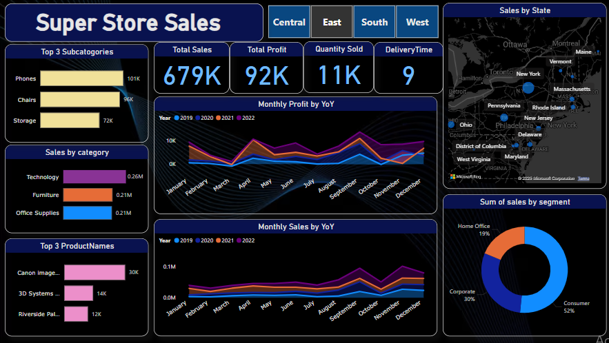

# 📊 Superstore Sales Dashboard - Power BI

This project showcases a **Superstore Sales Dashboard** built using **Power BI**, designed to provide insights into sales performance across different regions, categories, and time periods. It is part of my journey in learning data analytics and Power BI.

## 📌 Objective

To analyze and visualize Superstore sales data using Power BI, enabling stakeholders to make data-driven decisions based on:

- Regional and state-wise performance
- Year-over-Year (YoY) trends
- Product performance and subcategories
- Profitability and delivery timelines

## 🔧 Tools & Technologies

- **Power BI**
- **DAX (Data Analysis Expressions)**
- **Data Modeling**
- **Data Transformation (Power Query)**

## 📈 Key Insights from the Dashboard

- **Total Sales**: 679K | **Total Profit**: 92K | **Quantity Sold**: 11K
- **Top Subcategories**: Phones, Chairs, Storage
- **Top Performing Products**: Canon ImageCLASS, 3D Systems Printer, Riverside Palais
- **Sales by Category**: Technology leads with 0.26M
- **Segment Analysis**: Consumer segment dominates with 52%
- **Yearly Trends**: Visualized using YoY line charts for monthly sales and profit
- **Interactive Filters**: Region-based filtering (Central, East, South, West)

## 📸 Dashboard Snapshot

## 🧠 Learnings

- Created relationships between multiple tables for dynamic analysis
- Applied DAX functions for metrics like Total Profit, YoY Growth, and Delivery Time
- Designed a clean, interactive UI for easy navigation and filtering

